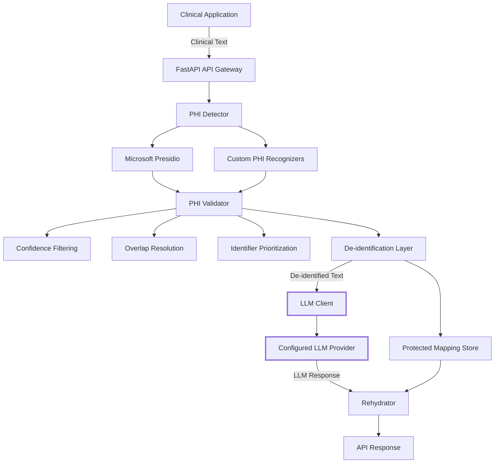

# Clinical Privacy Gateway — Architecture

## 1. Overview

The Clinical Privacy Gateway is a privacy-preserving API layer designed to protect Protected Health Information (PHI) before clinical text is processed by a downstream Large Language Model (LLM).

The gateway acts as a security boundary between the application handling clinical information and the external or downstream model.

The core privacy principle is:

> **Raw PHI must never be sent to the downstream LLM.**

The system therefore follows the processing pipeline:

**Detect → Validate → De-identify → Process → Rehydrate**

---

## 2. High-Level Architecture



The important security boundary is between the de-identification layer and the LLM.

Only de-identified text is permitted to cross that boundary.

---

## 3. Privacy Boundary

The gateway separates sensitive clinical information from downstream model processing.

```text
                    TRUSTED APPLICATION BOUNDARY

Clinical Text
     |
     v
+-----------------------+
|    PHI Detection      |
|                       |
| Presidio + Custom     |
| Recognizers           |
+-----------+-----------+
            |
            v
+-----------------------+
|    PHI Validation     |
|                       |
| Score Filtering       |
| Overlap Resolution    |
| Identifier Priority   |
+-----------+-----------+
            |
            v
+-----------------------+
|   De-identification   |
|                       |
| PHI -> Safe Tokens    |
+-----------+-----------+
            |
            | SAFE TEXT ONLY
            v
================================================
                 PRIVACY BOUNDARY
================================================
            |
            v
+-----------------------+
|      LLM Client       |
|                       |
| Configured Provider   |
+-----------+-----------+
            |
            v
+-----------------------+
|     LLM Processing    |
|                       |
| Receives masked text  |
+-----------+-----------+
            |
            | LLM Response
            v
+-----------------------+
|      Rehydrator       |
|                       |
| Token -> Original PHI |
+-----------+-----------+
            |
            v
       API Response
```

### Security Principle

The LLM should receive:

```text
Patient Patient_001 was born on DATE_001
and lives in LOCATION_001.
```

The LLM should **not** receive:

```text
Patient Marcus Whitfield was born on 14 March 1978
and lives in Boston.
```

---

## 4. Component Architecture

### 4.1 API Gateway

The FastAPI layer provides the external API interface.

Responsibilities include:

- accepting clinical text requests
- validating API input
- invoking the PHI protection pipeline
- returning de-identified or processed results
- exposing health and processing endpoints

Relevant API operations include:

```text
GET  /health
POST /api/v1/deidentify
POST /api/v1/process
```

---

### 4.2 PHI Detector

The PHI detector identifies sensitive entities in clinical text.

The detection layer combines:

- Microsoft Presidio
- built-in Presidio recognizers
- custom PHI recognizers

This allows the gateway to detect both standard PHI categories and domain-specific clinical identifiers.

---

### 4.3 Custom PHI Recognizers

The project extends the standard PHI detection capability with custom recognizers for clinical identifiers that require domain-specific patterns and context.

Examples include:

```text
MEDICAL_RECORD_NUMBER
ACCOUNT_NUMBER
HEALTH_PLAN_BENEFICIARY_NUMBER
```

These recognizers are integrated into the PHI detection pipeline alongside the existing Presidio entities.

---

### 4.4 PHI Validator

The validator acts as a quality-control layer between detection and de-identification.

Its responsibilities include:

1. applying minimum confidence thresholds
2. resolving overlapping detections
3. prioritizing important clinical identifiers
4. removing weak or conflicting detections
5. selecting the most appropriate entity span

This layer is important because multiple recognizers can identify overlapping portions of the same text.

For example, an identifier such as:

```text
MRN PCG-4471902
```

may potentially trigger more than one recognizer.

The validator ensures that the intended clinical identifier takes precedence.

---

### 4.5 De-identification Layer

After validation, detected PHI is replaced with safe placeholder tokens.

Example:

```text
Original:

Patient Marcus Whitfield was born on 14 March 1978
and lives in Boston.
```

After de-identification:

```text
Patient Patient_001 was born on DATE_001
and lives in LOCATION_001.
```

The purpose is to preserve the useful clinical structure of the text while preventing the downstream model from receiving the original sensitive values.

---

### 4.6 Protected Mapping Store

The gateway maintains the relationship between generated placeholder tokens and the original PHI values.

Conceptually:

```text
Patient_001      -> Marcus Whitfield
DATE_001         -> 14 March 1978
LOCATION_001    -> Boston
```

The mapping is kept inside the application's controlled processing layer.

The mapping identifier can be used to associate the processing transaction with its corresponding mapping without exposing the mapping itself to the downstream LLM.

---

### 4.7 LLM Client Layer

The LLM client provides an abstraction between the privacy gateway and the downstream language model.

The project supports a configurable provider architecture so that the gateway is not tightly coupled to a single model provider.

The important privacy requirement is:

```text
LLM input = de-identified text
```

not:

```text
LLM input = original clinical text
```

---

### 4.8 Rehydrator

After the LLM has generated its response, the rehydration layer can replace recognized safe tokens with the corresponding original values from the protected mapping.

Example:

```text
LLM response:

Clinical summary: Patient Patient_001 was born on DATE_001
and lives in LOCATION_001.
```

Rehydrated response:

```text
Clinical summary: Patient Marcus Whitfield was born on
14 March 1978 and lives in Boston.
```

This step occurs **after** LLM processing.

Therefore, the original PHI does not need to be provided to the LLM to generate the response.

---

## 5. End-to-End Workflow

### Step 1 — Client Request

A clinical application submits text to the gateway.

Example:

```text
Patient Marcus Whitfield was born on 14 March 1978
and lives in Boston.
```

---

### Step 2 — PHI Detection

The detector analyzes the text and identifies PHI entities.

Example detections:

```text
PERSON      -> Marcus Whitfield
DATE_TIME   -> 14 March 1978
LOCATION    -> Boston
```

---

### Step 3 — PHI Validation

The detected entities are passed through the validation layer.

The validator performs:

```text
Confidence filtering
        +
Overlap resolution
        +
Identifier prioritization
```

Only accepted detections continue to the de-identification stage.

---

### Step 4 — De-identification

Accepted PHI is replaced with safe tokens.

```text
Original:

Patient Marcus Whitfield was born on 14 March 1978
and lives in Boston.
```

```text
Protected:

Patient Patient_001 was born on DATE_001
and lives in LOCATION_001.
```

The original values are associated with their generated tokens inside the controlled mapping layer.

---

### Step 5 — LLM Processing

The protected text is sent to the configured LLM.

The LLM receives:

```text
Patient Patient_001 was born on DATE_001
and lives in LOCATION_001.
```

It does not receive:

```text
Marcus Whitfield
14 March 1978
Boston
```

This is the central privacy property of the gateway.

---

### Step 6 — Response Rehydration

The LLM response is passed to the rehydration layer.

Tokens that belong to the protected mapping can be restored to their original values.

```text
Patient_001
    |
    v
Marcus Whitfield
```

```text
DATE_001
    |
    v
14 March 1978
```

```text
LOCATION_001
    |
    v
Boston
```

---

### Step 7 — API Response

The gateway returns the processed response to the requesting application.

The response may also contain a mapping identifier associated with the processing transaction.

The mapping identifier is not the PHI itself.

---

## 6. Data Flow

The complete data flow can be summarized as:

```text
Clinical Application
        |
        | Original Clinical Text
        v
   API Gateway
        |
        v
   PHI Detector
        |
        v
   PHI Validator
        |
        v
 De-identification
        |
        +--------------------+
        |                    |
        | Safe Text           | Protected Mapping
        v                    v
   LLM Client          Mapping Store
        |
        | Safe Text
        v
       LLM
        |
        | Response
        v
   Rehydrator <---------- Mapping Store
        |
        v
   API Response
```

---

## 7. Example Data Transformation

### Original Input

```text
Patient Marcus Whitfield was born on 14 March 1978
and lives in Boston.
```

### Detected PHI

```text
PERSON      = Marcus Whitfield
DATE_TIME   = 14 March 1978
LOCATION    = Boston
```

### Protected Text

```text
Patient Patient_001 was born on DATE_001
and lives in LOCATION_001.
```

### Text Sent to LLM

```text
Patient Patient_001 was born on DATE_001
and lives in LOCATION_001.
```

### Example LLM Response

```text
Clinical summary: Patient Patient_001 was born on DATE_001
and lives in LOCATION_001.
```

### Rehydrated Response

```text
Clinical summary: Patient Marcus Whitfield was born on
14 March 1978 and lives in Boston.
```

---

## 8. Supported PHI Detection

The project combines standard Presidio entities with custom clinical recognizers.

Examples include:

| PHI Category | Detection Method |
|---|---|
| PERSON | Presidio |
| LOCATION | Presidio |
| DATE_TIME | Presidio |
| EMAIL_ADDRESS | Presidio |
| PHONE_NUMBER | Presidio |
| MEDICAL_RECORD_NUMBER | Custom recognizer |
| ACCOUNT_NUMBER | Custom recognizer |
| HEALTH_PLAN_BENEFICIARY_NUMBER | Custom recognizer |

The exact set of entities is determined by the recognizers configured in the application.

---

## 9. Security Properties

The architecture is designed around the following security properties:

### Raw PHI Isolation

Original PHI is processed inside the gateway before communication with the downstream LLM.

### LLM Privacy Boundary

Only de-identified text should cross the gateway-to-LLM boundary.

### Detection Validation

PHI detections are validated before they are used for de-identification.

### Identifier Prioritization

Domain-specific clinical identifiers can take precedence over weaker overlapping detections.

### Controlled Rehydration

Original values are restored only through the application's controlled mapping process.

### Mapping Separation

The downstream LLM does not need access to the original PHI-to-token mapping.

---

## 10. Architectural Design Principles

The system follows several design principles:

### Separation of Responsibilities

Each stage has a specific responsibility:

```text
API Gateway
     |
     v
Detection
     |
     v
Validation
     |
     v
De-identification
     |
     v
LLM Processing
     |
     v
Rehydration
```

This makes the system easier to test, maintain, and extend.

### Defense in Depth

PHI protection does not depend on a single detection mechanism.

The architecture combines:

```text
Presidio
+
Custom Recognizers
+
Validation
+
Mapping Controls
+
Privacy Boundary Tests
```

### Provider Abstraction

The LLM integration is separated from the privacy pipeline so that the downstream provider can be changed without redesigning the PHI protection architecture.

### Testability

The architecture separates components sufficiently to allow unit, API, integration, and security-oriented tests.

---

## 11. Architecture Summary

The Clinical Privacy Gateway can therefore be summarized as:

```text
             ORIGINAL CLINICAL TEXT
                       |
                       v
                +-------------+
                | PHI Detector|
                +------+------+
                       |
                       v
                +-------------+
                |PHI Validator|
                +------+------+
                       |
                       v
                +-------------+
                |De-identifier|
                +------+------+
                       |
                       | SAFE TEXT ONLY
                       v
              =====================
                PRIVACY BOUNDARY
              =====================
                       |
                       v
                +-------------+
                |     LLM     |
                +------+------+
                       |
                       | RESPONSE
                       v
                +-------------+
                |  Rehydrator |
                +------+------+
                       |
                       v
                 API RESPONSE
```

The key architectural guarantee is:

> **The downstream LLM receives de-identified clinical text rather than raw PHI.**